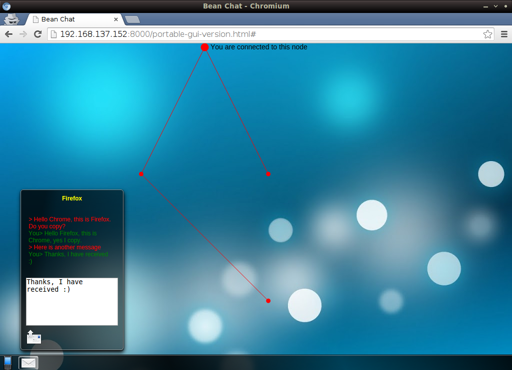

# BeanChat P2P
Implements a Peer-To-Peer text messaging network using Raspberry Pi
microcomputers and a web interface for visual interaction with the
network.

Dependencies
------------

 * websockify (https://github.com/kanaka/websockify)
 * a Java compiler
 * a Java runtime environment

Getting Started
---------------

 1. Copy this repository on all Raspberry Pis to be deployed on the
	network.

 2. On each Raspberry Pi compile the Java files with the command
	`javac -cp json-simple-1.1.1.jar *.java`.

 3. On the first Pi start the server with the command
	`java TextServer FirstPi`. Open a new terminal to this Pi for
	executing subsequent commands.

 4. On the second Pi start the server with the command
	`java TextServer SecondPi`. Open a new terminal to this Pi for
	executing subsequent commands.

 5. On the first Pi run the command
	`java NetworkAdvertise FirstPi IP_ADDR_SecondPi`
	replacing `IP_ADDR_SecondPi` with the IP address of the second
	Raspberry Pi. Open a new terminal to this Pi for executing
	subsequent commands.

 6. On the second Pi run the command
	`java NetworkAdvertise SecondPi IP_ADDR_FirstPi`
	replacing `IP_ADDR_FirstPi` with the IP address of the first
	Raspberry Pi. Open a new terminal to this Pi for executing
	subsequent commands.

 7. On the first Pi open the file `BeanChatPortableApp/mesh.js` in a
	text editor (such as nano) and change the line 
	`var BOOTSTRAP_NODE = "piNode@uoit.msh"; // Node which this client is connected to`
	to
	`var BOOTSTRAP_NODE = "FirstPi"; // Node which this client is connected to`.
	Also change the line
	`websocket = new WebSocket("ws://192.168.137.8:8001/websocket", ['binary']); // Change to Pi's IP`
	to
	`websocket = new WebSocket("ws://PI_ETH:8001/websocket", ['binary']); // Change to Pi's IP`
	where `PI_ETH` is the IP address of the network interface which
	links the Raspberry Pi to the host computer.

 8. On the second Pi open the file `BeanChatPortableApp/mesh.js` in a
	text editor (such as nano) and change the line 
	`var BOOTSTRAP_NODE = "piNode@uoit.msh"; // Node which this client is connected to`
	to
	`var BOOTSTRAP_NODE = "SecondPi"; // Node which this client is connected to`.
	Also change the line
	`websocket = new WebSocket("ws://192.168.137.8:8001/websocket", ['binary']); // Change to Pi's IP`
	to
	`websocket = new WebSocket("ws://PI_ETH:8001/websocket", ['binary']); // Change to Pi's IP`
	where `PI_ETH` is the IP address of the network interface which
	links the Raspberry Pi to the host computer.

 9. On both Raspberry Pis, start MultiThreadedRx by running the command
	`java MultiThreadedRx`. Open a new terminal to this Pi for executing
	subsequent commands.

 10. On both Raspberry Pis, start websockify by running the command
	`python websockify.py 8001 127.0.0.1:9998`. You must switch into the
	directory where you downloaded websockify to before running this
	command. Open a new terminal to this Pi for executing subsequent
	commands.

 11. On both Raspberry Pis, switch to the directory 
	`BeanChatPortableApp` and start a simple HTTP server for the web
	interface by running the command `python -m SimpleHTTPServer`.

 12. In two different web browsers (not another tab or window of the same
	browser) visit the IP address of each Raspberry Pi on port 8000. For
	example if your Pi has the IP address 192.168.1.76 point your
	browser to `http://192.168.1.76:8000/portable-gui-version.html`

 13. In each browser, click on the phone menu and *Create Identity*.
	Enter a different name for each browser and a PGP key will be
	generated.

 14. Refresh both browsers (F5).

 15. In each browser, click on the phone menu and *Login*.
 
 16. In each browser, click on the phone menu then *Network Tasks* then
	*Discover Nodes*. Repeat this process until both users can see
	each other.

 17. In each browser, add the other user by clicking on the phone menu,
	then *Add Buddy*, then the name of the other user. Optionally verify
	the PGP key of the other user and click OK.

 18. You can now chat. Click the phone menu, then *Chat*, then the name
	of the user which you wish to chat with. This will open a chat
	window. Type a message and click the send button.

